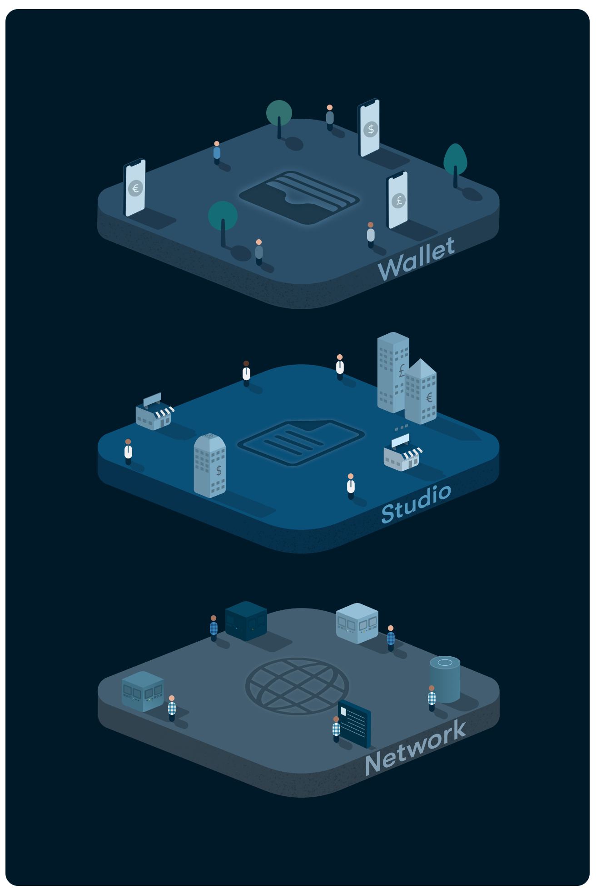

# FAQ

## What is Blokista?

  
****Blokista enables businesses and communities around the world to unleash the power of mobile payments. With Blokista, entrepreneurs and community leaders can now upgrade their existing communities into thriving micro-economies by providing them the tools to build and maintain their own custom-branded mobile wallet and currency. 

Currently for a company or community to enter the mobile payment space they are dependent on existing players such as PayPal and Stripe. Alternatively, they can build their own payment system from scratch. Neither of these options are optimal. Companies such as PayPal and Stripe charge upwards of 3% per transaction and don't allow for individual customization options while building your own payment system produces a huge technical and monetary burden to build. 

By using a non-custodial open-source technology users can avoid regulatory, operational and development costs greatly reducing the barrier to entry for all who want to tap into the power of mobile payments. 

The cost saved by removing intermediaries \(like Visa, Stripe and PayPal\) leaves room for local operators to create their own new and unique business models.

## How it works? 

Blokista solves these issues by providing a three-layer technology stack that allows anyone to create their own custom branded currency and wallet without the technical barrier and without high transaction fees. Fees on the Blokista network are $0.01, at most!

_Fuse provides three separate layers of technology, all playing an essential role in the Blokista network._ 

#### **Layer 1**

**Blokista** is a DPOS blockchain run by a network of validators allowing for fast, low cost and secure transactions to all users on the network. 

[Learn more about Blokista](https://docs.bccscan.com/become-a-validator/how-to-become-a-validator)

#### **Layer 2**

**Blokista Studio** is an easy to use tool that allows entrepreneurs and community leaders to easily customize their currency and wallet with various plugins for extra features and utilities.   
  
****[Learn more about Blokista Studio](https://docs.bccscan.com/the-fuse-studio/overview)

#### **Layer 3**

**Blokista wallet** is an easy to use mobile application that anyone can download and join of the any of the thousands of micro-economies running on Blokista. 

[Learn more about Blokista wallet](https://docs.bccscan.com/the-mobile-wallet/overview)  
****

## **What is the Blokista Studio?**

The Blokista Studio is a smart contract platform built on top of Ethereum intended for entrepreneurs and community leaders. Built with multiple plugins and customizable settings, any individual in a few simple steps can create their own digital wallet and mint their own custom branded currency allowing companies and communities to execute secure and free mobile payments with ease.   
****

## **How is Blokista different from PayPal, Square, Stripe etc.?** 

On Blokista, there is no central authority or intermediary. No one but the user holds their funds. Verified by Blokista’s DPoS blockchain there is no need for trust in a 3rd party. And since there's no 3rd party involved looking to earn money, fees on the Blokista are extremely low. 1 cents per transaction at most as opposed to the 2-5% fees that many payment systems charge. 

Additionally many payment systems like PayPal do not allow for any customization. You need to use their platform with the predefined framework they built for you. On Blokista you get to mint your own token and customize your economy and wallet with a wide array of different plugins. 

## **Can I integrate bank account/credit/debit payments in my community?**

Yes, credit card integration is a core feature of Blokista. After first launching your economy you can add a payment gateway to your wallet through the plug-in page. You will need to turn on the gateway you choose and a "top-up" menu item will appear to the users of your community on their mobile wallet. The payment gateways vary between different jurisdictions and banking integration options like credit/debit cards and wire transfers. Our payment integrations are: Ramp, Coindirect, Moonpay, Carbon and Wyre.

## **What are some use cases for Blokista?** 

There are many different parties who can benefit from launching their own digital economy. Be it a community leader who wants to provide the possibility of secure mobile payments to their community or a business owner who wants to create their own branded company tokens that provide users with discounts and other benefits. 

Some other use cases are:

* Consumer payments
* Credits, points, loyalty systems
* Shared ownership
* Making stable coins more accessible
* Integrate Defi

Check out our featured live micro-economies launched on Blokista: [https://studio.bccscan.com/view/communities](https://studio.bccscan.com/view/communities)

## **What is the purpose of the Blokista token?** 

The Blokista token aka BCC is the internal currency of the Blokista.  Those validating the network are paid in BCC. This aligns the incentives between the validators and the network users. Learn more about BCC tokenomics: [https://docs.bccscan.com/the-fuse-chain/fuse-token](https://docs.bccscan.com/the-fuse-chain/fuse-token)

## **Is there any reason for me to have BCC?** 

BCC is only needed by the community owner to fund the transactions of the network. This ensures that users can use the Blokista for free. Additionally, any BCC holder can play a role in the security of the system by buying BCC and staking it to a validator they trust. This further aligns the incentives between all network users because it puts pressure on the validators to act in the best interest of the network. If a validator does not act in the best interest of the network they risk losing the support of the community which is bound to have a financial impact on that validator. Users who stake their BCC are rewarded with more BCC. 

## **How much does it cost to launch an economy on Blokista?**

The only cost of launching an economy on Blokista is paying Ethereum gas prices. Which can range between 10-100 USD \(depending on gas prices at the time\). Another option is to launch an economy on the Ropsten testnet for free. 

## **What is the Blokista Wallet?** 

**T**he Blokista wallet is an easy to use wallet that holds BCC, ETH and all tokens minted on Ethereum and the Blokista as well as multiple fiat currencies, allowing anyone to participate in the micro-economy of their choice!  
  
**Download it here -   
App Store:** [https://apps.apple.com/il/app/fuse-wallet/id1491783654](https://apps.apple.com/il/app/fuse-wallet/id1491783654)  
**Play Store:** [https://play.google.com/store/apps/**details?id=io.fuse.fusecash&hl=en**](https://play.google.com/store/apps/details?id=io.fuse.fusecash&hl=en)\*\*\*\*

## **How do I create an economy on Blokista?**

Creating your own customized economy on Blokista is easy and only takes a few minutes. Check out this video walking you through the entire process: [https://www.youtube.com/watch?v=Lh3pKLdUR60](https://www.youtube.com/watch?v=Lh3pKLdUR60)

## Why is the Bridge so expensive? 

Transferring from Ethereum network to Blokista network involves transaction on the Ethereum blockchain and hence you will need to pay gas on Ethereum network. Once you relay to Blokista network the costs are almost negligible and you can also trade freely on Fuseswap.

